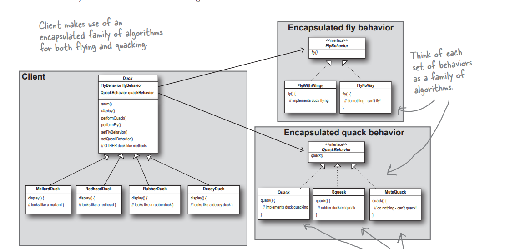

# design-patterns
Practice Design Patterns

Design principle:
Identify the aspects of your application that vary and separate them from what stays the same. 
Design Principle:
Program to an interface, not an implementation.

Strategy Pattern:
The Strategy Pattern shines when you need to switch between different algorithms or behaviors at runtime. 
For instance, consider a payment processing system. You might have multiple ways to process payments: credit card, PayPal, or bank transfer.
 With the Strategy Pattern, each payment method is encapsulated in its own class, and you can choose which one to use at runtime without changing the client code. 
 It is like having a toolkit where you can swap out tools based on the task at hand.

 In the repo, the user selects the type of duck dynamically and based on the duck the implementation changes and the methods behave differently.
 

 